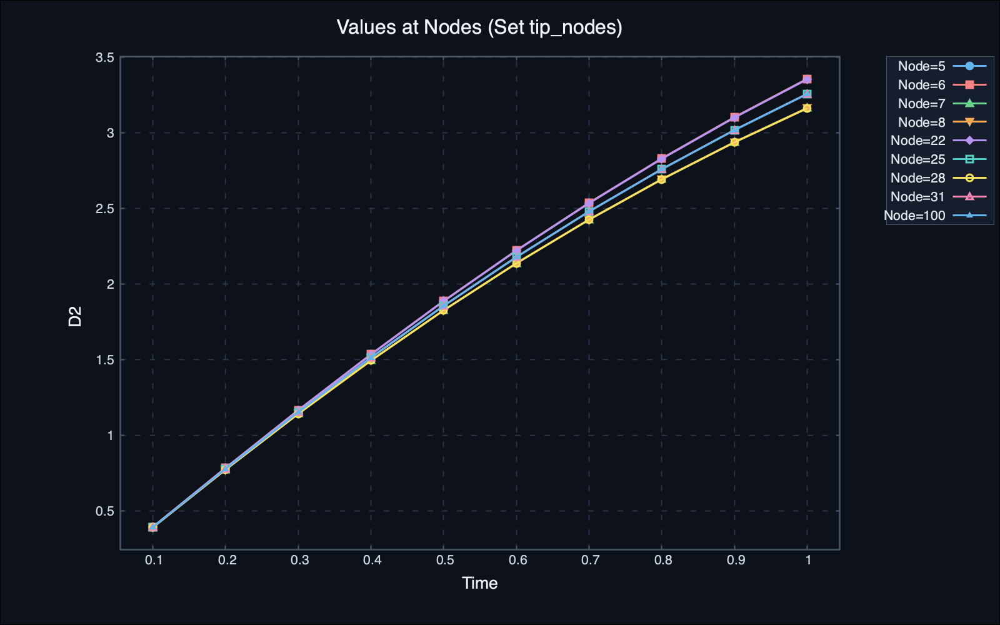
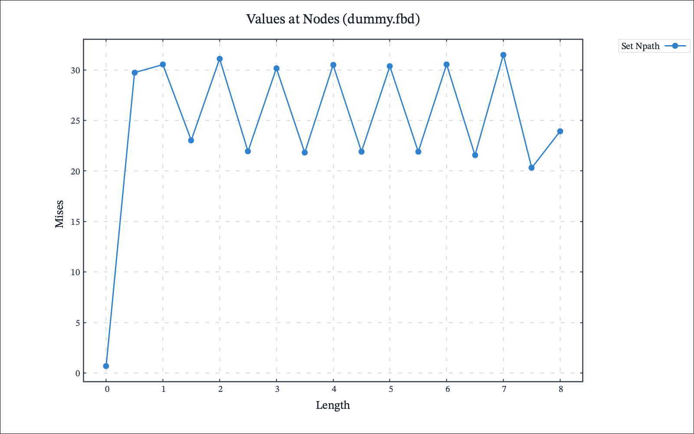

# Modern 2D Plotting Pipeline & Scientific Typography

CalculiX GraphiX (GLFW Edition) includes an updated 2D plotting subsystem that interfaces seamlessly with **Gnuplot** and **Python (Matplotlib)**. It modernizes the original post-processing workflows designed by Klaus Wittig by replacing legacy monochrome PostScript output with high-resolution digital and vector formats, dual typography tailored for screen presentations and academic publication, and auto-generated companion scripts.

---

## 1. Overview & Architecture

In classic CGX, invoking 2D graph commands (`graph <set> l +`, `graph <set> f ...`, `graph <file> p ...`) exported raw coordinate data files (`graph_<Nr>.out`) and generated legacy Gnuplot scripts (`graph_<Nr>.gnu`) targeting monochrome PostScript (`set terminal postscript eps`). CGX then attempted to spawn the legacy X11 PostScript previewer `gv` (Ghostview), which is largely unavailable on modern operating systems.

The modernized pipeline refines this flow:
```
┌─────────────────────────────────────────────────────────────┐
│             CalculiX GraphiX Engine (graph.c)               │
└──────────────┬───────────────────────────────┬──────────────┘
               │                               │
       Generates Data & Scripts         Generates Companion
               │                               │
               ▼                               ▼
      ┌─────────────────┐             ┌─────────────────┐
      │  graph_<Nr>.out │             │  graph_<Nr>.py  │
      │  graph_<Nr>.gnu │             └────────┬────────┘
      └────────┬────────┘                      │
               │                               │ Matplotlib / NumPy
        Spawns Gnuplot                         │ (User customization)
               │                               ▼
               ▼                      ┌─────────────────┐
      ┌─────────────────┐             │ Interactive GUI │
      │  graph_<Nr>.png │             │ or Custom Plot  │
      │  (or .svg/.pdf) │             └─────────────────┘
      └────────┬────────┘
               │
      Cross-Platform Viewers
      (open / xdg-open / start)
```

1. **High-Resolution Vector & Raster Backends**: Uses Gnuplot's modern Cairo engine (`pngcairo`, `svg`, `pdfcairo`).
2. **Dual-Theme Typography**: Automatically adapts font families, sizes, and palette styling based on the active viewport background (Light Mode vs. Dark Mode).
3. **No OS Font Pollution**: Leverages fontconfig and system font fallback stacks (`STIX Two Text` / `Inter` / `DejaVu` / `Liberation` / `Arial`) without copying files or modifying system font caches.
4. **Standalone Python Companion Scripts**: Generates a self-contained `graph_<Nr>.py` alongside every plot for fast editing in Jupyter notebooks or academic pipelines.
5. **Cross-Platform Native Viewers**: Seamlessly opens plots with the operating system's native viewer (`open` on macOS, `xdg-open` on Linux, `start` on Windows).

---

## 2. Scientific Typography & Styling

The plotting engine distinguishes between two operating contexts: **Light Mode (Publication)** and **Dark Mode (Screen/Presentation)**.

### Font Stacks & Hierarchy

| Element | Light Mode (Publication / Paper) | Dark Mode (Screen / Presentation) | Font Size |
| :--- | :--- | :--- | :--- |
| **Title** | `STIX Two Text, DejaVu Serif, Liberation Serif, Cambria, serif` (Bold) | `Inter, Helvetica, Arial, DejaVu Sans, sans-serif` (Bold) | **24 pt** |
| **Axis Labels** ($X$, $Y$) | `STIX Two Text, DejaVu Serif, Liberation Serif, Cambria, serif` | `Inter, Helvetica, Arial, DejaVu Sans, sans-serif` | **20 pt** |
| **Tics & Legends** | `STIX Two Text, DejaVu Serif, Liberation Serif, Cambria, serif` | `Inter, Helvetica, Arial, DejaVu Sans, sans-serif` | **16 pt** |

* **Light Mode (Academic Publication)**: Defaults to high-quality serif typography matching standard LaTeX articles and academic journals (native `STIX Two Text` on macOS, `DejaVu Serif` or `Liberation Serif` on Linux, `Cambria` on Windows).
* **Dark Mode (Screen & Slides)**: Matches CGX's dark slate palette (`#0D121A`) using clean sans-serif typography (`Inter`, `Helvetica`, `Arial`).

### Visual Comparison: Dark vs. Light Mode

| Dark Mode (Screen & Presentation) | Light Mode (Academic Publication) |
| :---: | :---: |
|  |  |
| *Nonlinear cantilever tip displacement (Inter sans-serif, #0D121A dark theme)* | *1D spatial stress path (STIX Two Text serif, publication paper)* |

### Geometry & Margin Protection

To guarantee that high-DPI titles, sub-titles, and negative-offset axis labels are never cropped at the canvas boundary, all Gnuplot scripts enforce explicit screen margin boundaries:
```gnuplot
set lmargin at screen 0.12
set rmargin at screen 0.84
set bmargin at screen 0.12
set tmargin at screen 0.91
```

* **Label Offsets**: $X$-axis labels are positioned with `offset 0, -0.8`, $Y$-axis labels with `offset -1.5, 0`, and titles with `offset 0, 0.5`.
* **Literal Naming**: All titles and axis labels include the `noenhanced` attribute, preventing underscores in dataset names (e.g. `beam_modal.frd`) from inadvertently rendering as subscripts.
* **Engineering Grid**: Subtle dashed reference lines (`set grid xtics ytics lt 1 dt 2 lw 1.8`) provide clear spatial reference points in both Light Mode (`#CBD5E1`) and Dark Mode (`#2D3748`).

---

## 3. Supported Formats & Configuration

By default, plots are rendered as high-DPI raster images (**PNG** at 1600×1000 pixels). You can change the export format dynamically within CGX or via environment variables:

| Format | Command in CGX | Gnuplot Terminal | Resolution / Feature |
| :--- | :--- | :--- | :--- |
| **PNG (Default)** | `asgn viewformat png` | `pngcairo enhanced truecolor` | $1600 \times 1000$ px, subpixel antialiasing |
| **SVG** | `asgn viewformat svg` | `svg enhanced dynamic` | $1600 \times 1000$, infinite vector scaling |
| **PDF** | `asgn viewformat pdf` | `pdfcairo enhanced color` | Standalone vector PDF (auto-forces white paper) |

### Setting Environment Defaults
You can set your preferred default format in your shell configuration:
```bash
export CGXVIEWFORMAT=svg   # or pdf, or png
```

---

## 4. Standalone Python Companion Scripts (`graph_<Nr>.py`)

Whenever a 2D graph is generated, CGX automatically writes an accompanying Python script:
```text
graph_1.out   -> Raw tabular data
graph_1.gnu   -> Gnuplot rendering script
graph_1.png   -> Rendered image
graph_1.py    -> Standalone Matplotlib / NumPy companion script
```

### Key Features of Companion Scripts
* **Zero Dependencies Beyond Standard Scientific Stack**: Requires only `matplotlib` and `numpy`.
* **Synchronized Aesthetics**: Matches the exact colors, line widths, dashed grid style, and typography of the Gnuplot rendering.
* **Publication-Ready Layout**: Utilizes `plt.tight_layout(pad=1.8)` and saves high-resolution vector or raster output (`graph_<Nr>_matplotlib.png` at 300 DPI).
* **Interactive Inspection**: Run `python3 graph_<Nr>.py` directly from the terminal to inspect results in an interactive Matplotlib window or adapt it for custom figures.

---

## 5. Supported Plot Workflows & Commands

CGX supports three primary 2D graph categories:

### 1. Spatial Path Interpolation (`graph <set> l +`)
Interpolates the current scalar or vector component along a sequence of nodes or geometric line elements:
```text
cgx> ds 4 e 4          # Activate dataset (e.g. Mises Stress)
cgx> qadd path_nodes   # Select path nodes interactively
cgx> graph path_nodes l +
```

### 2. Multi-Node Frequency / Time Step Response (`graph <set> f ...`)
Extracts history or mode responses across all loaded time steps or modal frequencies for a node set:
```text
cgx> qadd tip_nodes    # Select nodes of interest
cgx> graph tip_nodes f DISP D3
```
Plots $D_3$ displacement versus frequency or step time for every node in `tip_nodes`.

### 3. Parameter-vs-Parameter Correlation (`graph <file> p ...`)
Plots relationships between arbitrary solver parameters extracted from monitor files or user tables:
```text
cgx> graph history.dat p TIME DISP_Y
```

---

## 6. Installation & Prerequisites

The 2D plotting pipeline relies on **Gnuplot** with Cairo support:
* **macOS**: `brew install gnuplot`
* **Ubuntu / Debian**: `sudo apt install gnuplot`
* **Fedora / RHEL**: `sudo dnf install gnuplot`
* **Arch / CachyOS**: `sudo pacman -S gnuplot`
* **Windows (MSYS2)**: `pacman -S mingw-w64-x86_64-gnuplot`

The automated installer (`install.sh`) checks for Gnuplot and installs it automatically via Homebrew on macOS or system package managers on Linux. If Gnuplot is not present on the host system, CGX logs an informative message advising how to install it, while continuing to safely export the raw data file (`graph_<Nr>.out`) and Python script (`graph_<Nr>.py`).
