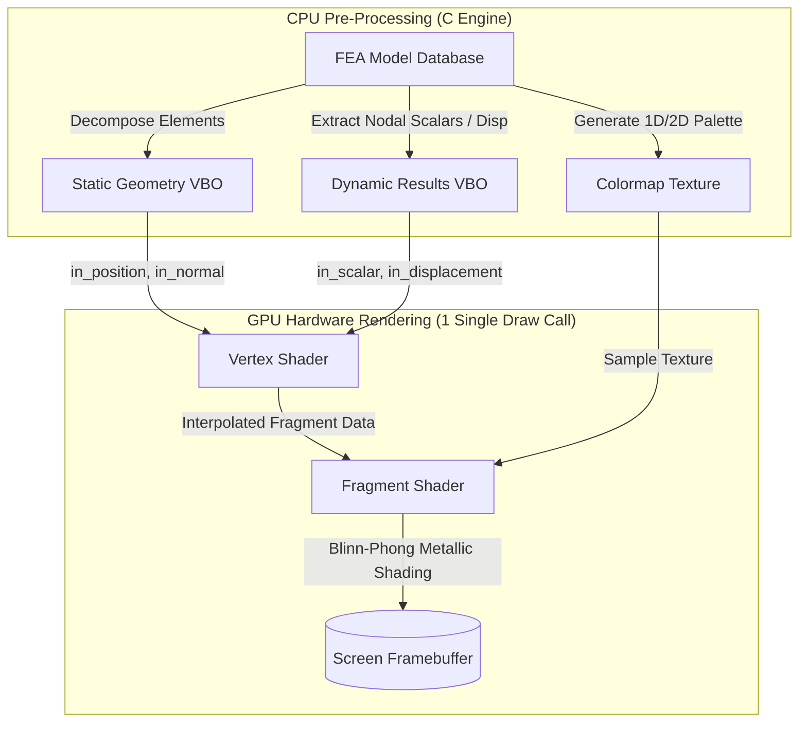

# CalculiX GraphiX (GLFW Edition) — Modern 3D GPU Pipeline Architecture

> **Technical architecture and inner mechanics of the modernized OpenGL 3D rendering pipeline in CalculiX GraphiX (GLFW Edition).**

---

## 1. Overview & Motivation

Classic CalculiX GraphiX (CGX) utilized OpenGL 1.1/1.2 immediate mode (`glBegin`/`glEnd`) and display lists (`glCallList`). While robust on vintage SGI workstations, this architecture introduced significant CPU-side bottlenecks on modern hardware:

* **CPU Call Overhead**: Rendering large finite element models required iterating through hundreds of thousands of elements on the CPU every time contour ranges or display modes changed.
* **Driver Deprecation**: Modern graphics APIs (macOS Metal, Vulkan, Direct3D 12) have completely removed fixed-function vertex pipelines and display lists.

The **Modern GPU Pipeline** in **CalculiX GraphiX (GLFW Edition)** introduces an optimized, hardware-accelerated architecture:



---

## 2. Dual-VBO Architecture & Memory Layout

To maximize memory bandwidth and eliminate redundant GPU buffer uploads, the vertex data is split into two specialized buffers:

```text
+---------------------------------------------------------------------------------------+
| 1. STATIC GEOMETRY VBO (Uploaded ONCE per mesh load / refinement)                    |
+-------------------+-------------------+-----------------------------------------------+
|  Position (X,Y,Z) |   Normal (NX,NY,NZ)|  Stride: 24 bytes (6 x float)                 |
+-------------------+-------------------+-----------------------------------------------+

+---------------------------------------------------------------------------------------+
| 2. DYNAMIC RESULTS VBO (Updated ONLY when dataset or displacement changes)           |
+-------------------+-------------------+-----------------------------------------------+
|   Scalar Value (S)| Disp (DX,DY,DZ)   |  Stride: 16 bytes (4 x float)                 |
+-------------------+-------------------+-----------------------------------------------+
```

### Vertex Data Structures (`cgx_vbo.h`):
```c
typedef struct {
    float x, y, z;        /* Model coordinates (X, Y, Z) */
    float nx, ny, nz;     /* Surface normal vector */
} CgxStaticVertex;

typedef struct {
    float scalar;         /* Normalized nodal scalar value */
    float dx, dy, dz;     /* Nodal displacement vector */
} CgxDynamicVertex;
```

---

## 3. Quadratic FEA Element Face Decomposition

CalculiX supports high-order quadratic elements with mid-side nodes (e.g. 20-node Hexahedra `Hex20`, 10-node Tetrahedra `Tet10`, 15-node Pentahedra `Penta15`). To render curved quadratic faces with exact geometric fidelity without tearing or twisting, our unpacker in `cgx_vbo.c` maps element faces directly into sub-triangle primitives:

### A. Quad8 (Type 10 — 8-Node Quadratic Quadrilateral Face)
* An 8-node quadratic face generates a center node at index `nod[8]`.
* It is unpacked into an **8-segment `GL_TRIANGLE_FAN`** radiating from `nod[8]` with discrete segment normal vectors `side[0..7]`:

```text
        Node 3 ---------- Node 6 ---------- Node 2
          |   \             |             /   |
          |     \    (5)    |    (4)    /     |
          |       \         |         /       |
        Node 7 -----\--- Node 8 ---/------- Node 5
          |       /   \     |     /   \       |
          |     /   (6) \   |   / (3)   \     |
          |   /           \ | /           \   |
        Node 0 ---------- Node 4 ---------- Node 1
```

$$\begin{aligned}
\Delta_0 &= (\text{nod}[8], \text{nod}[0], \text{nod}[4]), \quad \vec{n} = \text{side}[0] \\
\Delta_1 &= (\text{nod}[8], \text{nod}[4], \text{nod}[1]), \quad \vec{n} = \text{side}[1] \\
\Delta_2 &= (\text{nod}[8], \text{nod}[1], \text{nod}[5]), \quad \vec{n} = \text{side}[2] \\
\Delta_3 &= (\text{nod}[8], \text{nod}[5], \text{nod}[2]), \quad \vec{n} = \text{side}[3] \\
\Delta_4 &= (\text{nod}[8], \text{nod}[2], \text{nod}[6]), \quad \vec{n} = \text{side}[4] \\
\Delta_5 &= (\text{nod}[8], \text{nod}[6], \text{nod}[3]), \quad \vec{n} = \text{side}[5] \\
\Delta_6 &= (\text{nod}[8], \text{nod}[3], \text{nod}[7]), \quad \vec{n} = \text{side}[6] \\
\Delta_7 &= (\text{nod}[8], \text{nod}[7], \text{nod}[0]), \quad \vec{n} = \text{side}[7]
\end{aligned}$$

### B. Tri6 (Type 8 — 6-Node Quadratic Triangle Face)
* Subdivided into **4 planar sub-triangles**:
  * $\Delta_0 = (\text{nod}[0], \text{nod}[3], \text{nod}[5])$ with $\vec{n} = \text{side}[0]$
  * $\Delta_1 = (\text{nod}[2], \text{nod}[5], \text{nod}[4])$ with $\vec{n} = \text{side}[1]$
  * $\Delta_2 = (\text{nod}[4], \text{nod}[5], \text{nod}[3])$ with $\vec{n} = \text{side}[2]$
  * $\Delta_3 = (\text{nod}[3], \text{nod}[1], \text{nod}[4])$ with $\vec{n} = \text{side}[3]$

### C. Quad4 (Type 9 — 4-Node Linear Quadrilateral Face)
* Decomposed into **2 triangles**: $(\text{nod}[0], \text{nod}[1], \text{nod}[3])$ and $(\text{nod}[1], \text{nod}[2], \text{nod}[3])$ with shared facet normal $\vec{n} = \text{side}[0]$.

---

## 4. GLSL Shaders & Metallic Lighting

The rendering pipeline utilizes standard GLSL shaders (`cgx_shaders.c`) compatible with OpenGL 2.1 through OpenGL 4.x Core.

### 1. Vertex Shader (`vs_surface`)
Applies real-time modal deformation without recalculating node coordinates on the CPU:
$$\vec{P}_{\text{view}} = \mathbf{V} \cdot \mathbf{M} \cdot \left( \vec{P} + s_{\text{disp}} \cdot \vec{D} \right)$$
$$\vec{N}_{\text{view}} = \text{normalize}\left( \mathbf{N}_{\text{mat}} \cdot \vec{N} \right)$$

### 2. Fragment Shader (`fs_surface`)
* **Colormap Sampling**: Direct sampling of the 1D/2D texture coordinate $u = \text{clamp}(v_{\text{scalar}}, 0.0, 1.0)$.
* **Blinn-Phong Metallic Reflection**:
  $$I = I_{\text{ambient}} + I_{\text{diffuse}} \cdot \max(\vec{N} \cdot \vec{L}, 0) + I_{\text{specular}} \cdot (\vec{N} \cdot \vec{H})^{\alpha}$$
  * Specular Shininess $\alpha = 96.0$, Specular Strength $= 0.38$.
* **Lighting Toggle**: When Shaded Results is disabled (`u_use_lighting == 0`), outputs unshaded, pure flat colormap albedo.

---

## 5. ParaView-Style Logarithmic Scale

For fields spanning multiple decades (plastic strains, acoustic pressures, stress singularities), CGX implements the standard ParaView logarithmic transfer function:

$$u = \frac{\log_{10}(v) - S_{\min}}{S_{\max} - S_{\min}}, \quad S_{\min} = \log_{10}(v_{\min,\text{clamped}}), \quad S_{\max} = \log_{10}(v_{\max})$$

* **Zero & Negative Protection**: Non-positive values ($v \le 0$) are automatically clamped to the positive floor ($\max(v_{\text{pos,min}}, v_{\max} \times 10^{-4})$) and colored using the bottom color band with clear console diagnostic messages.
* **Legend Formatting**: Legend ticks are labeled in clear base-10 power notation (`10^1`, `10^2`, `10^3`, `10^-2`).

---

## 6. Cross-Platform OpenGL Extension Loader (`cgx_gl_loader.h`)

To eliminate heavy third-party loader dependencies (GLEW, GLAD) while ensuring turnkey compilation across operating systems:

* **macOS (Apple Silicon & Intel)**: Links statically to symbols exported by Apple's `OpenGL.framework`.
* **Linux (Wayland & X11)**: Activates `#define GL_GLEXT_PROTOTYPES 1` to link directly with Mesa / NVIDIA `libGL.so`.
* **Windows (MSVC & MinGW-w64)**: Dynamically resolves OpenGL 2.0+ shader and buffer function pointers on engine startup via GLFW's built-in loader:
  ```c
  glCreateShader = (PFNGLCREATESHADERPROC)glfwGetProcAddress("glCreateShader");
  glBindBuffer   = (PFNGLBINDBUFFERPROC)glfwGetProcAddress("glBindBuffer");
  glDrawArrays   = (PFNGLDRAWARRAYSPROC)glfwGetProcAddress("glDrawArrays");
  ```

---

## 7. Dual-Pipeline Runtime Coexistence

Users can seamlessly switch between the **Modern GPU Pipeline** and Klaus Wittig's **Legacy Display Lists** at runtime without restarting the application:

* **GUI Switch**: Right-click $\rightarrow$ **`GUI Settings > [Experimental] Modern GPU Pipeline`**.
* **Zero Overhead**: When toggled off, CGX falls back completely to the original OpenGL 1.x `glCallList` execution paths.
