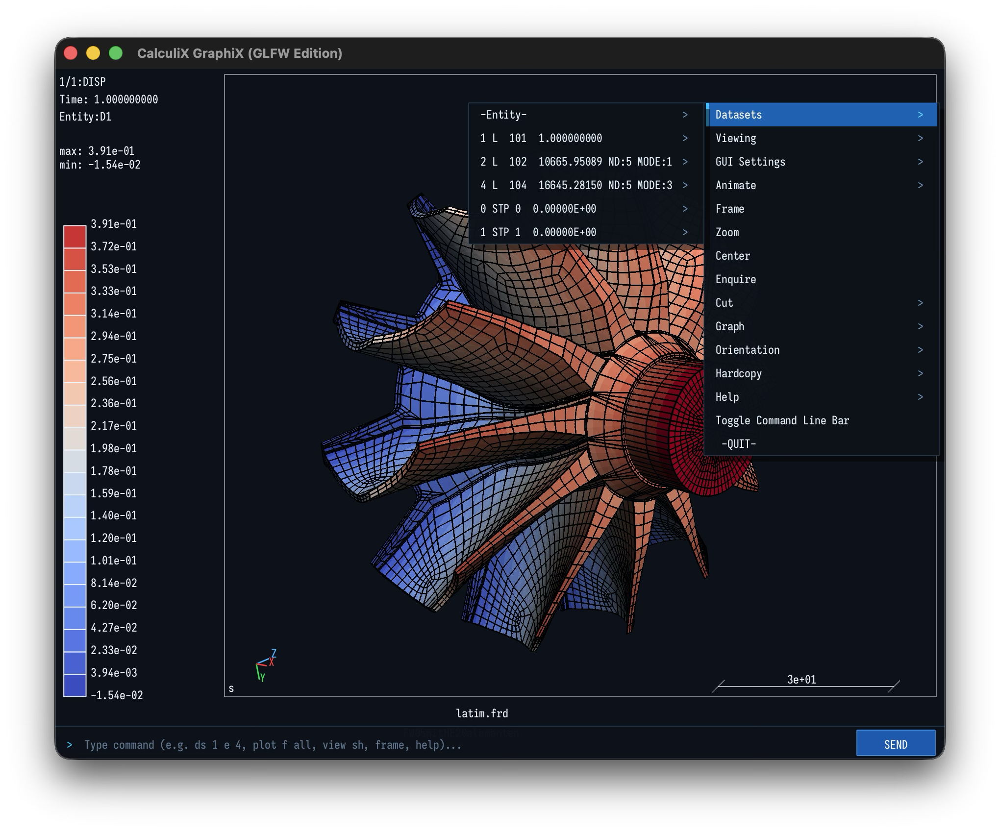

# CalculiX GraphiX (GLFW Edition)

> **A new 3D backend and multi-platform edition of CalculiX GraphiX.**

[](COPYING)
[](INSTALL.md)
[](#highlights--new-features)
[](#highlights--new-features)
[](GUI_EXTRA_FEATURES.md#6-native-paraview-vtupvd-exporter)



---

## About This Project

This project is a **didactic exercise for learning AI agentic development**, based on the great work of the original authors and contributors of **CalculiX GraphiX (CGX)**, originally led by **Klaus Wittig** (https://www.calculix.de/ See section _CalculiX GraphiX_).

There are two objectives of this project. First, is to explore agent-assisted refactoring by modernising CGX's windowing and rendering layer (via GLFW3) while keeping all core finite element mechanics and solver workflows completely intact. Second, is to make CGX compatible from single source for Linux, macOS and Windows. A new meshing implementation via TetGen is desired. These code additions are generated with Google Antigravity using Google Gemini 3.7 Flash, Gemini Pro 3.1 and Claude Opus 4.6.

---

## Highlights & New Features

* **New 3D backend via GLFW**: Windowing and input events are routed through a modern, native [**GLFW3**](https://www.glfw.org/) layer across macOS (Apple Silicon), Linux (x64/Arm), and Windows. Same codebase can be compiled among the three OSes.
* **Signature Dark Mode by Default**: Modern dark slate aesthetic.
* **True 3D Perspective Projection**
* **Interactive Command Bar with Fuzzy Suggestions**: In-window command line bar with history navigation (<kbd>↑</kbd>/<kbd>↓</kbd>) and intelligent Levenshtein typo suggestions (e.g. `fram` $\rightarrow$ `frame`).
* **Keyboard Navigation Modifiers**: <kbd>Shift</kbd>/<kbd>Ctrl</kbd>/<kbd>Cmd</kbd> + Left Drag to Pan, and <kbd>Alt</kbd>/<kbd>Option</kbd> + Left Drag to Zoom.
* **Native VTU/PVD Exporter**: export of results to VTK VTU [ParaView-compatible](https://vtk.org/) format (`send all vtu all`).
* Tetrahedral meshing is carried out via [TetGen](https://wias-berlin.de/software/index.jsp?id=TetGen&lang=1), internally.

> 📖 **Deep Dive**: For full details on all graphical enhancements, rendering options, and shortcuts, see [**GUI Extra Features**](GUI_EXTRA_FEATURES.md).

---

## Quick Start (Universal 1-Liner)

Install **CalculiX GraphiX (GLFW Edition)** on **macOS (Apple Silicon)** or **Linux** with a single command:

```bash
/bin/bash -c "$(curl -fsSL https://raw.githubusercontent.com/carlomontec/CalculiX-GraphiX-GLFW/main/install.sh)"
```

Then run from anywhere:
```bash
cgx_glfw <model.frd>
```

* **Windows**: Download standalone binaries from [**Releases**](https://github.com/carlomontec/CalculiX-GraphiX-GLFW/releases).
* **Detailed Guide**: For CMake build instructions, prerequisites, and options, see [**INSTALL.md**](INSTALL.md).
---

## Controls & Mouse Gestures

| Gesture / Shortcut | Action |
| :--- | :--- |
| **Left Click + Drag** | **Rotate / Orbit 3D Model** (smooth trackball rotation around model center) |
| **Shift + Left Drag** or **Ctrl/Cmd + Drag** | **Pan / Translate** model horizontally & vertically |
| **Alt / Option + Left Drag** | **Smooth Continuous Zoom** |
| **Scroll Wheel** or **Trackpad Pinch** | **Step Zoom** (unbounded zoom range) |
| **Right Click + Drag** | **Pan** (drag threshold $\ge 4\text{px}$) |
| **Right Click** (tap & release) | **Open Multi-Level Cascading Context Menu** |

---

## Popular Commands (Type in Bottom Bar)

| Command | Action |
| :--- | :--- |
| `frame` | Auto-fit and center the 3D model in the viewport |
| `view persp` | Switch to realistic 3D Perspective Projection |
| `view ortho` | Switch to classic Orthographic parallel view |
| `view dark` | Switch viewport to modern Dark Mode (`#0D121A`) |
| `view light` | Switch viewport to classic Light Mode (White) |
| `ds <step> e <comp>` | Load and display specific result dataset (e.g. `ds 4 e 4`) |
| `plot fv all` | Plot filled contour values on entire model |
| `plot f all` | Plot filled surfaces |
| `plot e all` | Plot element wireframe mesh |
| `cmap <palette>` | Change colormap (`coolwarm`, `turbo`, `viridis`, `inferno`, `jet`, `classic`) |
| `anim real` | Start real-time modal or transient animation |
| `send all vtu all` | Export entire model and all time-steps to ParaView `.vtu` & `.pvd` |

---

## License & Attribution

This project is free and open-source software distributed under the **GNU General Public License Version 2 (GPL-2.0 or later)**, strictly adhering to the original CalculiX licensing.

### Original Authors & Copyright:
* **CalculiX GraphiX (CGX)** is created and copyrighted by **Klaus Wittig** (`klaus.h.wittig@t-online.de`).
* **CalculiX CrunchiX (CCX)** is created and copyrighted by **Dr. Guido Dhondt** (`dhondt@t-online.de`).
* Official CalculiX website: [http://www.calculix.de](http://www.calculix.de) / [https://www.dhondt.de](https://www.dhondt.de)

### Project Maintainer & AI Pairing:
* This fork is an effort by **Dr-Ing. Carlo Monjaraz-Tec** ([@carlomontec](https://github.com/carlomontec)) as an open-source academic exploration of agent-assisted scientific software modernization.
* **Disclaimer**: This software is provided "AS IS", without warranty of any kind, express or implied. The authors assume no liability for errors, bugs, or damages.
